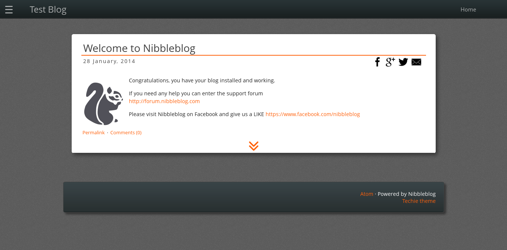
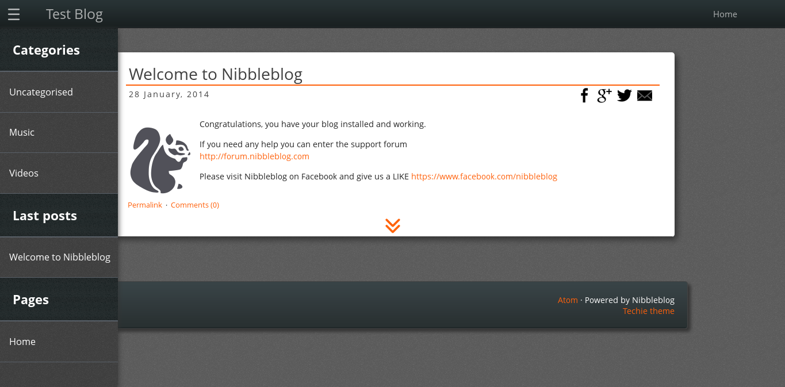
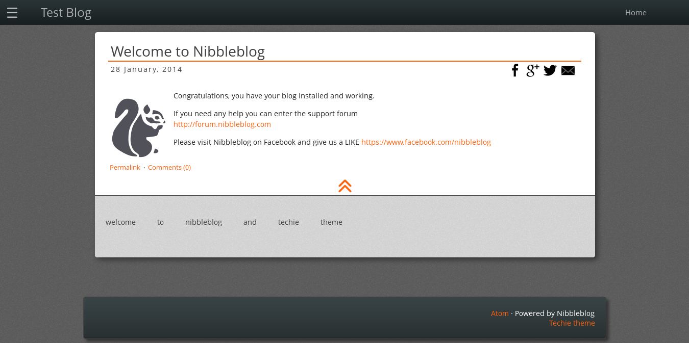

Techie theme for Nibbleblog
===========================

Techie is a dark and modern theme inspired by Firefox OS' Gaia interface.

*NOTE*: This theme has certain incompatibilities with older browsers, in particular with IE.

Status: **v0.2.1** (in development)

Compatible with Nibbleblog **4.0.3**

## Features

- Syntax highlighting
- Sidebar (when plugins enabled)
- Configurable navigation bar (through theme's `config.bit`)
- Simple social sharing for posts (show or hide through theme's `config.bit`)
- [Old browser detection](http://browser-update.org/)
- Content license placeholder at the footer (text specified through theme's `config.bit`)

## Screenshots

Home

Sidebar

Post tag list

